

This is a repository with codebase and results of the publication: "A Note on the Bias During Model-Validation in Drought Forecasting Applications"

#### Abstract

The Standardized Precipitation Index (SPI) is used for characterizing meteorological droughts on a range of time scales. When SPI is computed on the entire available dataset, which methodologically neglects model-validation, biases are introduced in both the training and validation sets. Here, we investigate the theoretical and numerical implications that arise when SPI is computed using the entire dataset, prior to model-validation. Our results indicate that SPI leads to increased information leakage to the training set with increased scales, which significantly affects the characterisation of drought severity. In Sweden the change in precipitation over the historical period can lead to miss-classifications of about 21% of drought events in the training set. The SPI bias also varies along the climatic gradient with warmer climates being more affected. This concludes that drought assessments under changing climatic conditions can be influenced by the potential misuse of SPI inducing bias in the future predictions.

#### How to use the code

The codebase of the publication can be found in the `main.R` script. The supporting functions to compute the bias and generate the analytical outcomes can be found in the `/src` folder. To parameterize the script and select the spi scale and the types of graphs that will be generated use the `config.cfg` file. The steps described below should be followed to reproduce the results:

1. Define the parameters in `config.cfg`
2. Run `main.R`
3. Under `/scr` run `runReporting.R`

**Important Note**: The available data has been provided by SMHI, therefore they are not available in this repository.

In the following sections we share analytical outputs that further support the experiments of the publication.

### Percentage of miss-classifications
  

##### SPI(3)
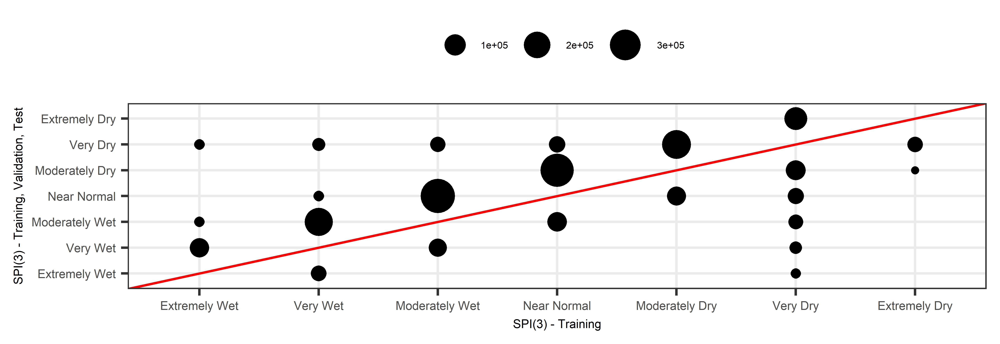
##### SPI(6)
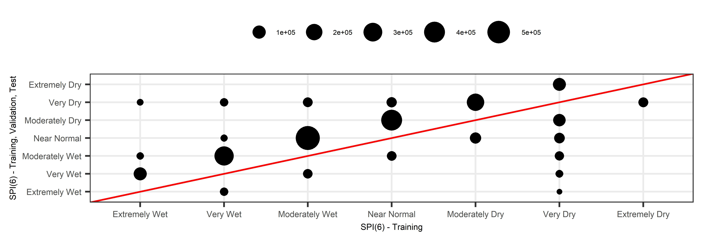
##### SPI(9)
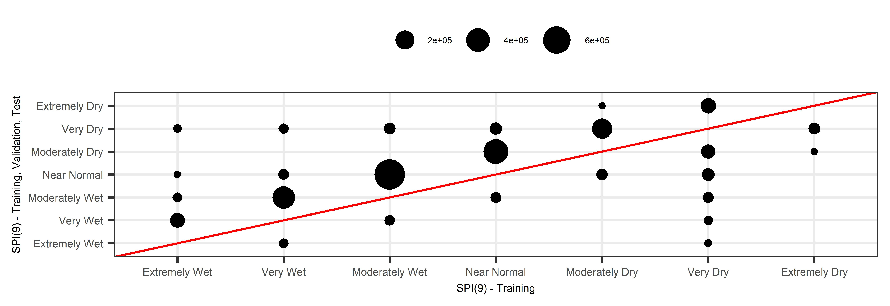
##### SPI(12)
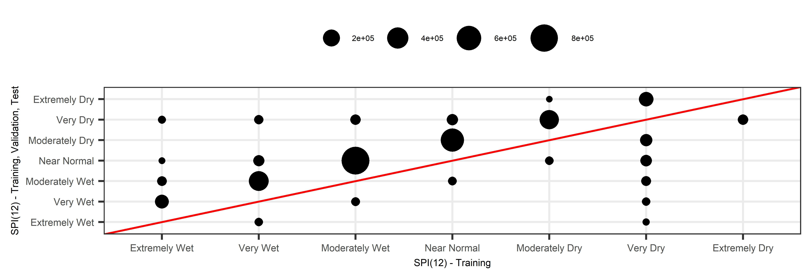
##### SPI(24)
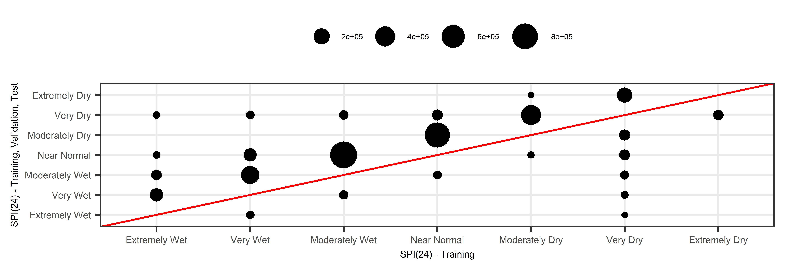

### Comparison of distribution parameter estimates

##### SPI(3)
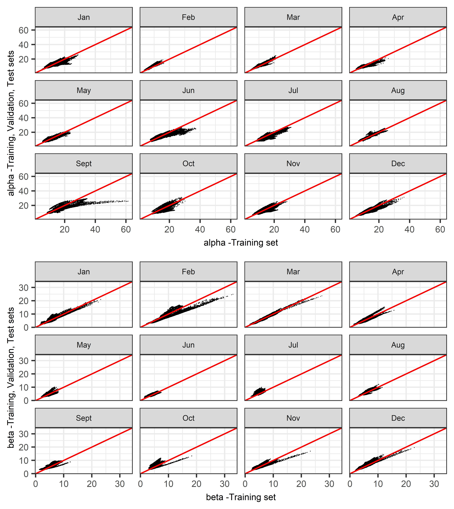
##### SPI(6)
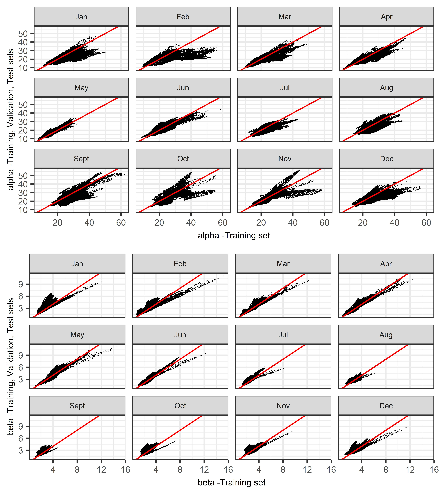
##### SPI(9)

##### SPI(12)
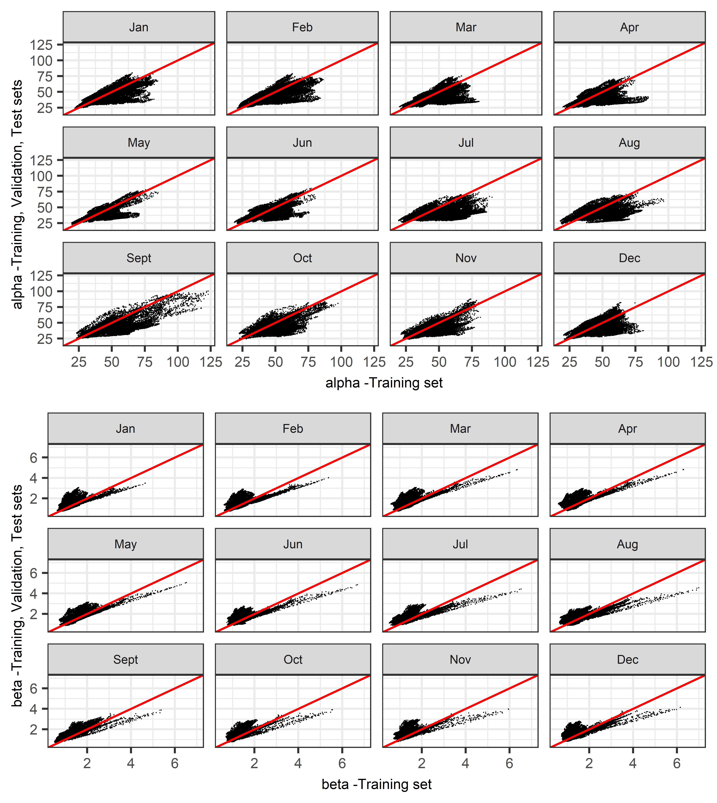
##### SPI(24)
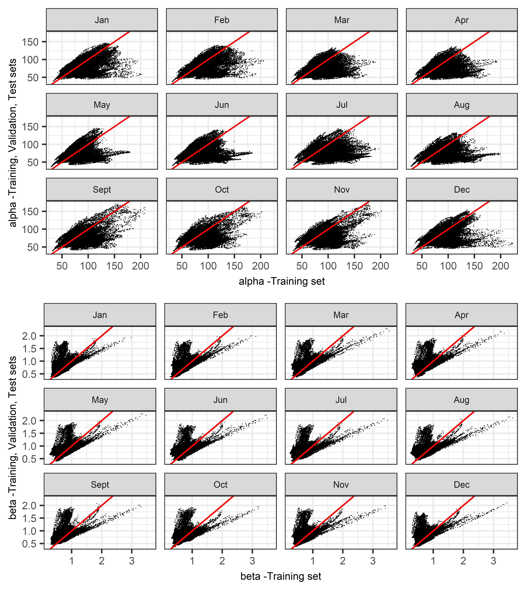

### Comparison of raw spi data for basin S-3216

##### SPI(3)
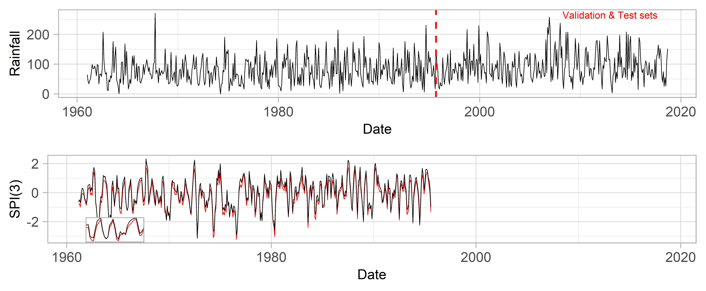
##### SPI(6)

##### SPI(9)
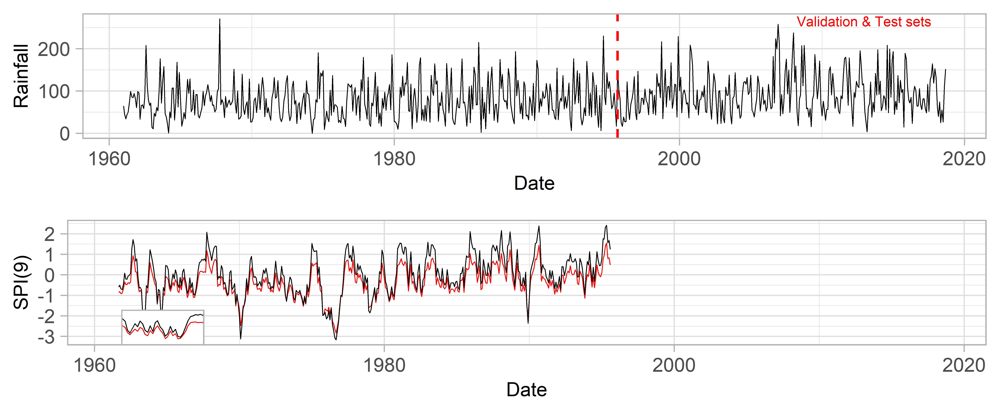
##### SPI(12)
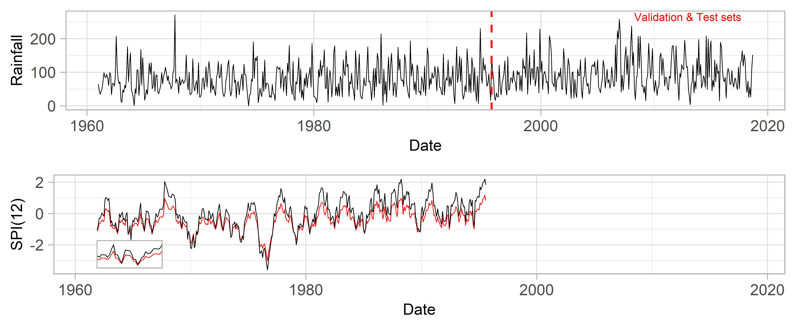
##### SPI(24)
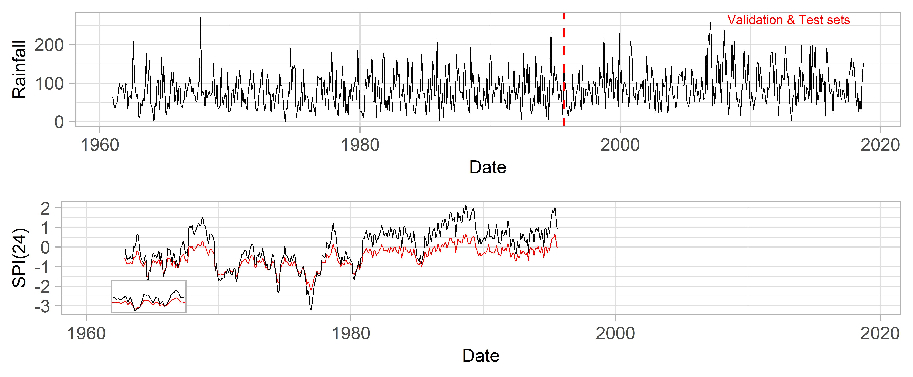

### Comparison between the densities of accumulated precipitation for basin S-3216

##### SPI(3)
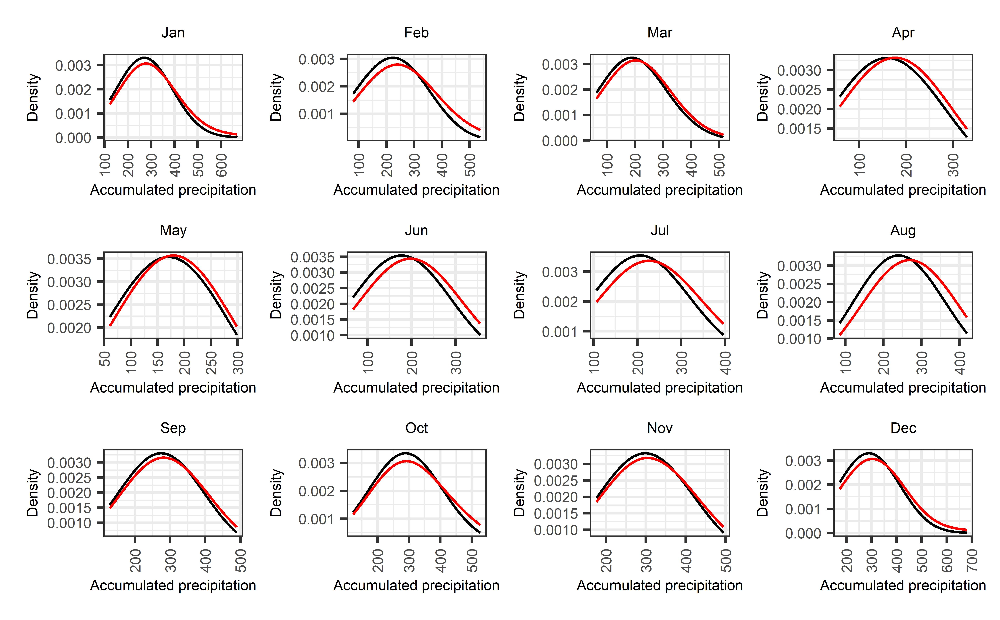
##### SPI(6)
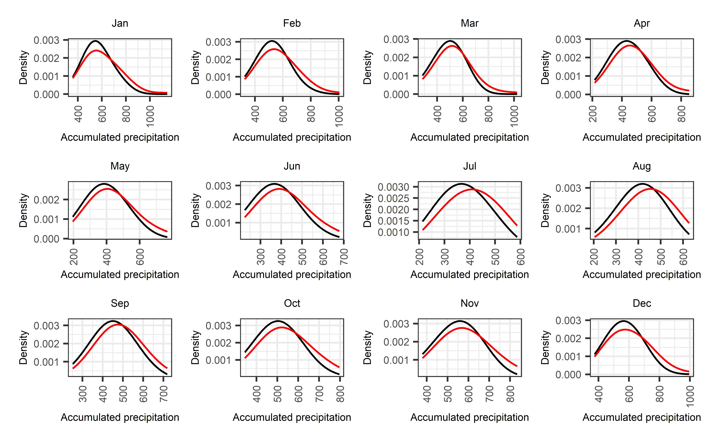
##### SPI(9)
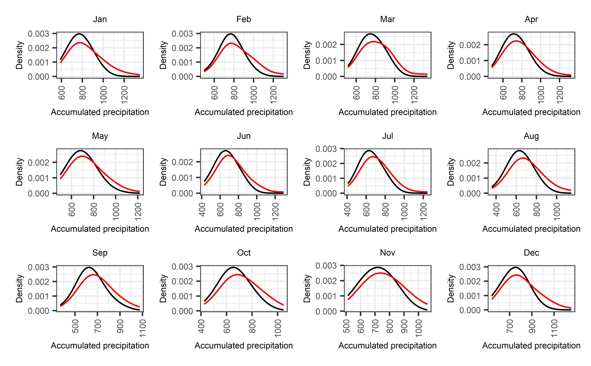
##### SPI(12)
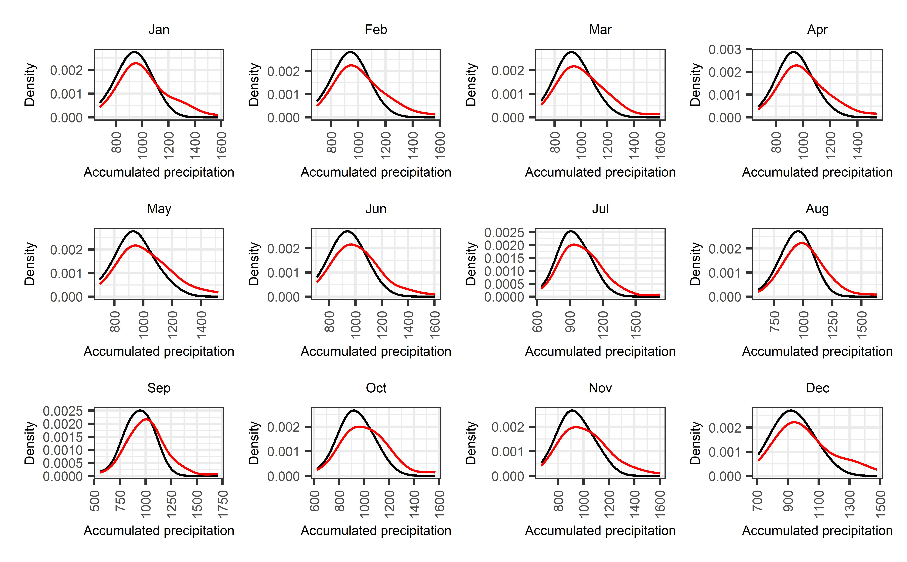
##### SPI(24)
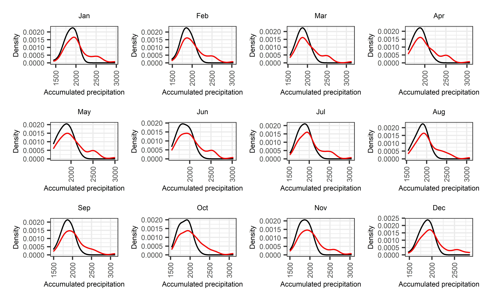

### Relationship between the bias introduced to the training data and the change in the mean monthly precipitation

##### SPI(3)

##### SPI(6)

##### SPI(9)

##### SPI(12)

##### SPI(24)

